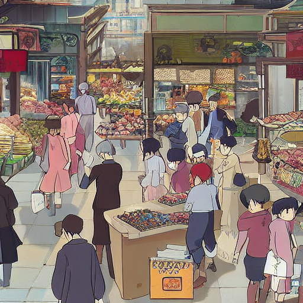

# Ghibli Market: LoRA Style-Tuning with Stable Diffusion v1.5

This project fine-tunes **Stable Diffusion v1.5** using **Low-Rank Adaptation (LoRA)** to generate **Studio Ghibli-inspired market scenes**. A custom style token, `<sks>`, is introduced to enable prompt-based control over the learned artistic style while keeping the original Stable Diffusion parameters frozen. LoRA adapters are applied to both the **UNet** and the **CLIP text encoder**, satisfying the assignment requirements.

---

## Team Members

- Welle Hewage Dinely Shanuka
- Mahalakshmi Jayaraman
- Sandeep Das

---

## Overview

The project implements a complete LoRA fine-tuning pipeline using the Hugging Face Diffusers library. Instead of updating all Stable Diffusion parameters, lightweight LoRA adapters are trained while the original model remains frozen, making the approach computationally efficient.

The trained model learns a Ghibli-inspired artistic style from a dataset of **843 images** and generates stylized market scenes from the prompt:

```text
a busy market, in <sks> style
```

---

## Features

- Stable Diffusion v1.5
- Dual-adapter LoRA fine-tuning
  - UNet
  - CLIP Text Encoder
- Custom style token (`<sks>`)
- Parameter-efficient training
- SafeTensors checkpoint export
- Reproducible training with fixed random seed
- Command-line training and evaluation scripts

---

## Project Structure

```text
.
├── code/
│   ├── train_lora.py          # Training entry point
│   └── eval_lora.py           # Evaluation script
│
├── src/
│   ├── dataset.py             # Dataset loader
│   ├── inference.py           # Image generation
│   ├── model.py               # Stable Diffusion + LoRA setup
│   └── training.py            # Training pipeline
│
├── lora_out/
│   └── pytorch_lora_weights.safetensors
│
├── samples/                   # Generated sample images
├── style_imgs/                # Training dataset
├── requirements.txt
├── README.md
└── report.pdf
```

---

## Requirements

- Python 3.10+
- PyTorch 2.x
- CUDA-capable GPU (recommended)
- Hugging Face Diffusers
- PEFT
- Transformers
- Accelerate
- Safetensors

Install the required packages:

```bash
pip install -r requirements.txt
```

---

## Training

Train the LoRA adapters using:

```bash
python code/train_lora.py \
  --data_dir style_imgs/512 \
  --instance_token "<sks>" \
  --output_dir lora_out \
  --rank 16 \
  --learning_rate 1e-4 \
  --resolution 512 \
  --batch_size 1 \
  --max_steps 1600 \
  --overwrite
```

The trained LoRA adapter is saved as

```text
lora_out/pytorch_lora_weights.safetensors
```

---

## Evaluation

Generate images using the trained adapter:

```bash
python code/eval_lora.py \
  --weights lora_out/pytorch_lora_weights.safetensors \
  --prompt "a busy market, in <sks> style" \
  --outdir samples \
  --num_images 3 \
  --seed 42
```

Generated images are saved in

```text
samples/
```

---

## Training Configuration

| Parameter | Value |
|-----------|------:|
| Base model | Stable Diffusion v1.5 |
| Dataset | 843 images |
| Resolution | 512 × 512 |
| Style token | `<sks>` |
| LoRA rank | 16 |
| Learning rate | 1e-4 |
| Batch size | 1 |
| Training steps | 1600 |
| Checkpoint interval | 200 |
| Random seed | 42 |

---

## Implementation Details

### LoRA Target Modules

**UNet**

- `to_q`
- `to_k`
- `to_v`
- `to_out.0`

**CLIP Text Encoder**

- `q_proj`
- `k_proj`
- `v_proj`
- `out_proj`

### Training Procedure

1. Load Stable Diffusion v1.5.
2. Add the custom token `<sks>` to the tokenizer.
3. Initialize the new token from the existing `"style"` embedding.
4. Freeze the original Stable Diffusion parameters.
5. Attach LoRA adapters to both the UNet and CLIP text encoder.
6. Train the LoRA parameters using diffusion noise-prediction loss.
7. Save the trained adapters as a single SafeTensors checkpoint.

---

## Runtime

Training was performed on an **NVIDIA A100 GPU**.

Approximate runtime:

| Task | Runtime |
|------|---------|
| Training (1600 steps) | ~5 minutes |
| Evaluation (3 images) | ~10 seconds |

---

## Reproducibility

The implementation uses:

- Stable Diffusion v1.5
- Fixed random seed (42)
- SafeTensors checkpoints
- Deterministic evaluation prompt
- Command-line interface for both training and evaluation

---

---

## Sample Result

The figure below shows a representative image generated by the trained LoRA model using the prompt:

```text
a busy market, in <sks> style
```

<p align="center">
  
</p>


## Deliverables

The final submission contains:

- `code/train_lora.py`
- `code/eval_lora.py`
- `lora_out/pytorch_lora_weights.safetensors`
- `samples/`
- `requirements.txt`
- `README.md`
- `report.pdf`

---

## References

- Hu, E. J., et al. (2021). **LoRA: Low-Rank Adaptation of Large Language Models.** https://arxiv.org/abs/2106.09685
- Hugging Face Diffusers Documentation: https://huggingface.co/docs/diffusers
- PEFT Documentation: https://github.com/huggingface/peft